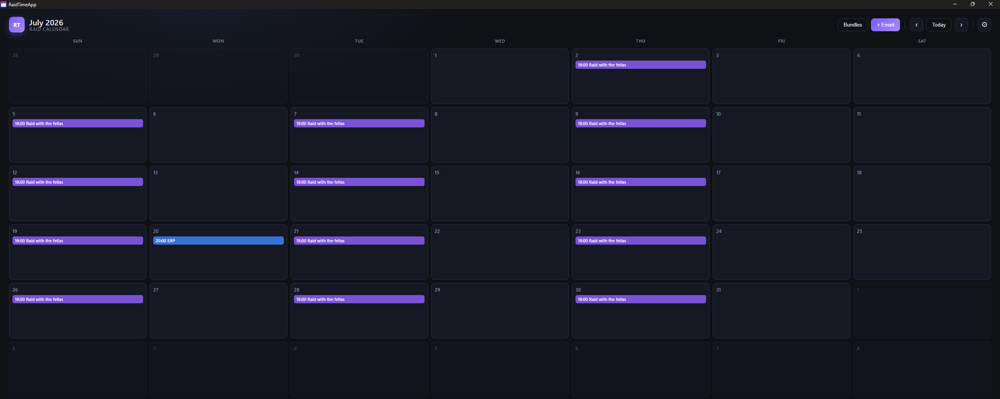
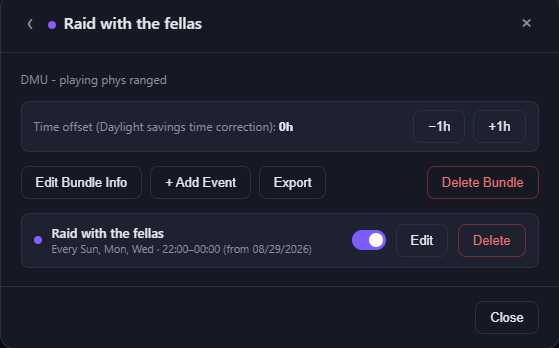
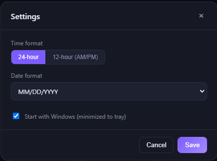

# RaidTimeApp

A simple desktop calendar for MMORPG raid and guild schedules. Keep track of
recurring raid nights, one-off events, and get a reminder before they start
— all running quietly in your system tray.

## What it does

- **Recurring or one-time events** — set a raid to repeat every week on
  certain days, or schedule a single one-off event.
- **Reminders** — get a Windows notification before an event starts, and
  another right when it begins. Still works while the app is minimized to
  the tray.
- **Rosters (bundles)** — group your regular raid nights together under one
  name and color, so your whole week's schedule is easy to read at a
  glance.
- **Share a schedule** — export a roster to send to a friend or guildmate;
  they can import it straight into their own calendar.
- **Time zone drift** — if your group's schedule slips an hour around
  daylight saving changes, nudge a roster's time by ±1 hour without editing
  every event by hand.
- **Starts with Windows** — opens automatically at login, minimized to the
  tray, so it's just quietly there when you need it.

## Rosters

Group related raid nights into a roster with its own name and color. Add,
edit, or remove events for that roster from one place.

## Settings

Choose 12-hour or 24-hour time, pick your preferred date format, and toggle
whether the app launches at Windows startup.

Your schedule is saved locally on your own machine — nothing is uploaded
anywhere. This application does not have network capabilities.

## License

GPL-3.0. See [LICENSE](LICENSE).
